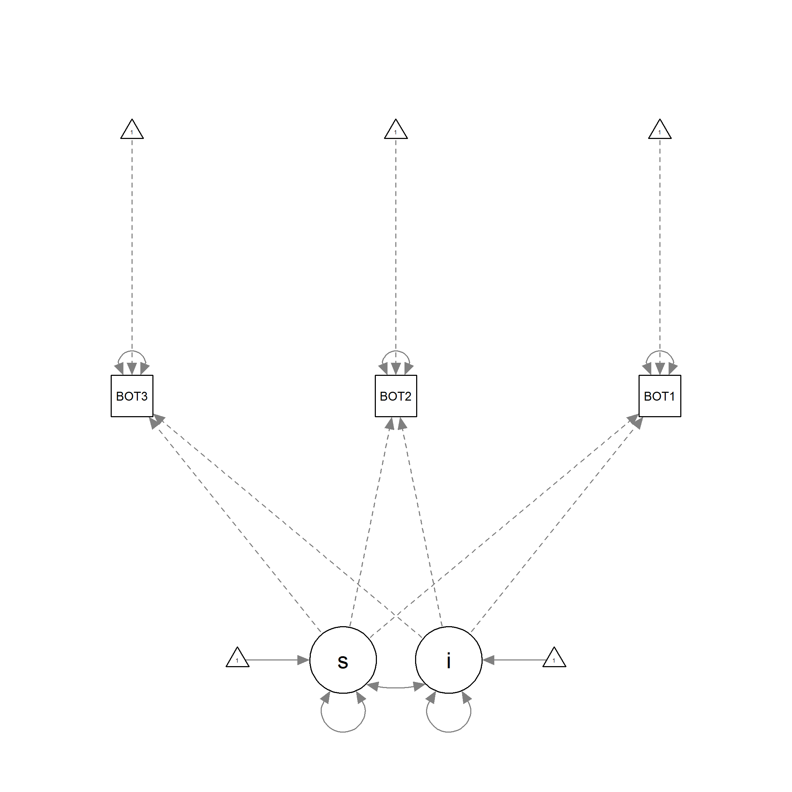

# Reporting research to facilitate reproducibility [First-level header]
## Test with RMarkdown [Second-level header]

This is a **test** project with RMarkdown.

```{r, echo=FALSE, warning=FALSE, error=FALSE, message=FALSE}
# you need to activate the necessary packages within RMarkdown because it doesn't have access to the object that are currently in your R session
library(tidyverse)
```

```{r}
# In this document, I use the code chunks to provide comments for the Markdown code

# Adding lists
# remember to add a space at end of the header row
```

### List of my RMarkdown test projects 
1. Course material for SEM with R
2. Reproducible research with RMarkdown

```{r}
# Adding links
# [caption] (link)
```

[The research group I'm working in: "Learning and Development in School"](http://www.learninginschool.fi/)

```{r}
# Adding picture
# 
# the name of the picture is enough if the picture is saved into the same directory with the R project
# otherwise add the whole file path
```


```{r}
# Adding equations into the document
# $equation$
```

#### Area of a circular region
$A = \pi*r^{2}$

#### The mass-energy equivalence is described by the famous equation
$$E=mc^2$$
```{r}
# Changing text colors
# define colors with some html code (CSS style)
```

Roses are <span style="color:red">red</span>,
violets are <span style="color:blue">blue</span>.

```{r}
# Including R code into the document
A <- 10
a <- 3
print(paste("A is", A))
print(paste("a is", a))
cat("Are A and a equal? =", A == a)
```

##### The code is not run, only displayed.

```{r, eval=FALSE}
# Including R code into the document
A <- 10
a <- 3
print(paste("A is", A))
print(paste("a is", a))
cat("Are A and a equal? =", A == a)
```


```{r}
summary(cars)
nrow(cars)
```

```{r, echo=FALSE}
# the code is not shown in the knitted document, only run
plot(pressure)
```

```{r, warning=FALSE, error=FALSE}
4
```

```{r, fig.width=5, fig.height=4, echo=TRUE}
# "echo=TRUE" allows showing the code too

plot(mpg$displ, mpg$hwy)

ggplot(data=mpg) + 
geom_point(aes(x=displ, y=hwy, color=class))
```

```{r, fig.width=6, fig.height=5, fig.align='left', echo=TRUE}
# dimensions can be increased up to 12 points
# figures can be aligned
ggplot(data=mpg) + 
geom_point(aes(x=displ, y=hwy, color=class))
```